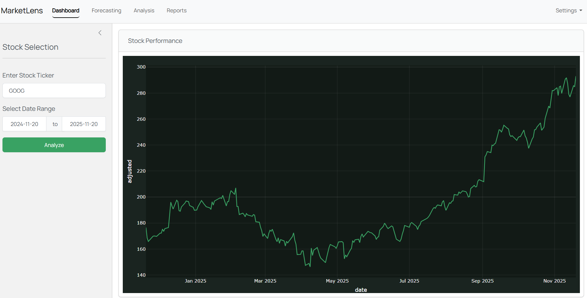
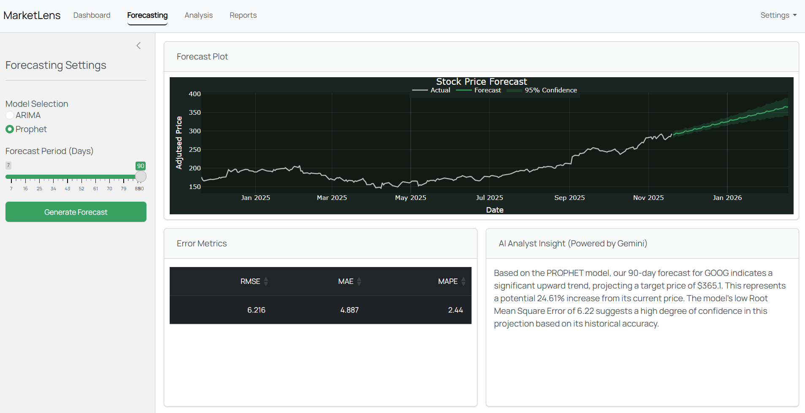
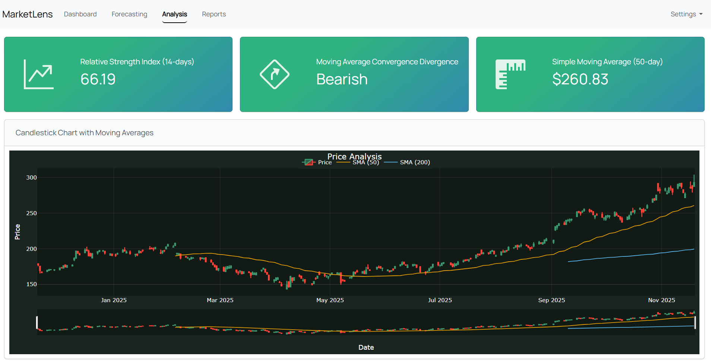
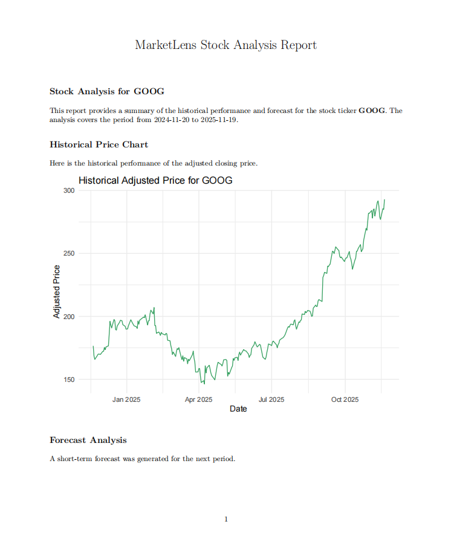
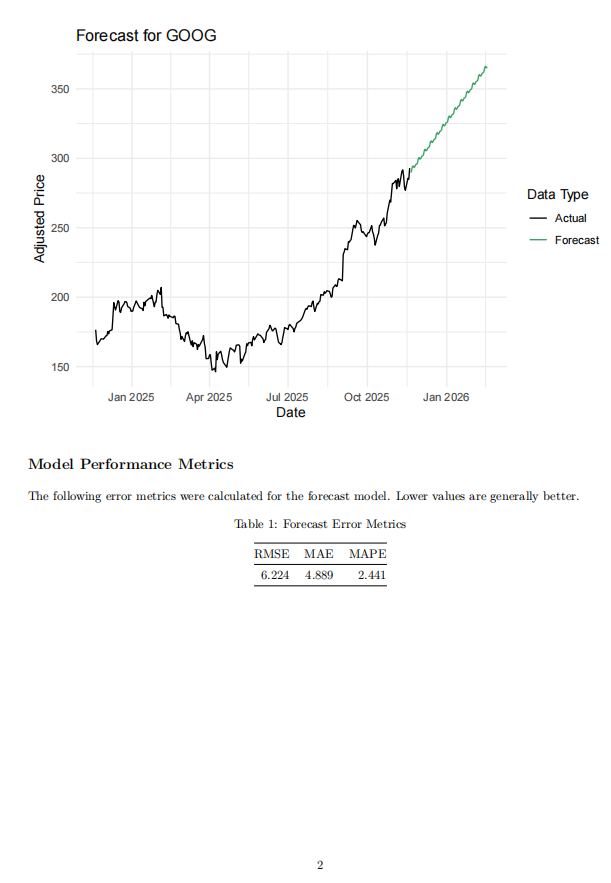

# 📈 MarketLens: AI-Powered Stock Analysis Dashboard

<center>


</center>

**MarketLens** is an interactive stock market forecasting and analysis application built with **R** and **Shiny**. It combines real-time financial data with time-series forecastings models (ARIMA & Prophet) and Generative AI (Google Gemini) to provide actionable investment insights.

## ✨ Key Features
- 📊 **Interactive Dashboard:** Live stock data visualisation using `plotly` and `tidyquant` (Yahoo Finance API).
- 🔮 **Advanced Forecasting:**
  - Compare **ARIMA** vs. **Prophet** models side-by-side.
  - Visualise prediction intervals (95% confidence).
  - View detailed error metrics (RMSE, MAE, MAPE) with explanatory tooltips.
- 🤖 **AI Analyst Insights:** Integrated **Google Gemini 2.5 Pro** to generate natural language summaries of forecast trends and model confidence.
- 📉 **Technical Analysis:** Deep dive with interactive Candlestick charts, SMA (50/200), RSI, and MACD indicators.
- 🌗 **Dynamic UI:** Modern, responsive interface built with `bslib` featuring a toggleable **Dark/Light mode**.
- 📄 **PDF Reporting:** Generate and download professional PDF analysis reports using `rmarkdown`.

## 📸 Screenshots
Dashboard Light  |    Dashboard Dark
:-------------:|:-------------:
 | 

<center> 

**Forecasting with AI** 

</center>



<center> 

**Technical Analysis**

</center>



PDF Report Pg 1 | PDF Report Pg 2
:--------------:|:---------------: 
 | 


## 🛠️ Tech Stack
- **Core**: R, Shiny, bslib (UI)
- **Data & Manipulation:** tidyverse, tidyquant, lubridate
- **Visualisation:** plotly, DT(DataTables)
- **Modeling:** forecast (ARIMA), prophet
- **AI Integration:** httr2 (Google Gemini API)
- **Reporting:** rmarkdown, knitr, tinytex

## 🚀 Installation & Setup
Follow these steps to run MarketLens locally.

### 1. Prerequisites
Ensure you have the following installed:
- [R](https://cran.r-project.org/) (Version 4.0 or higher)
- [VS Code](https://code.visualstudio.com/) or RStudio
- **Pandoc**: Required for generating PDF reports.
  - [Download Pandoc here](https://pandoc.org/installing.html).
  - *Note: Restart your IDE after installing Pandoc.*

### 2. Clone the Repository
```
git clone https://github.com/chunwei-07/MarketLens.git
cd MarketLens
```

### 3. Install R Packages
Open your R console and run:
```
install.packages(c(
  "shiny", "bslib", "tidyverse", "plotly", 
  "tidyquant", "htmltools", "forecast", 
  "DT", "prophet", "rmarkdown", "httr2", "glue"
))
```

### 4. Set Up API Keys (Important!)🔑
This app uses the **Google Gemini API** for AI insights. You need a free API key.
1. Get your key from [Google AI Studio](https://aistudio.google.com/app/api-keys).
2. Create a new file in the project root named `.Renviron`.
3. Add your key to the file:
```
GEMINI_API_KEY=AIzaSy...[Your Actual Key]...
```
4. **Security Note:** The `.Renviron` file is included in `.gitignore` to prevent it from being uploaded to GitHub.

### 5. Run the App
You can launch the app directly from the R Terminal:
```
shiny::runApp('app.R')
```

## 📂 Project Structure
```
MarketLens/
├── app.R                 # Main application logic (UI & Server)
├── report_template.Rmd   # Template for generating PDF reports
├── .Renviron             # API keys (Hidden/Ignored by Git)
├── .gitignore            # Git ignore rules
└── README.md             # Documentation
```

## 🤝 Contributing
Contributions, issues, and feature requests are welcome! Feel free to fork the repository and submit a pull request.

## 📜 License
This project is open-source and available under the **MIT License**.

---

<center>

*Built by chunwei-07*

</center>

---
